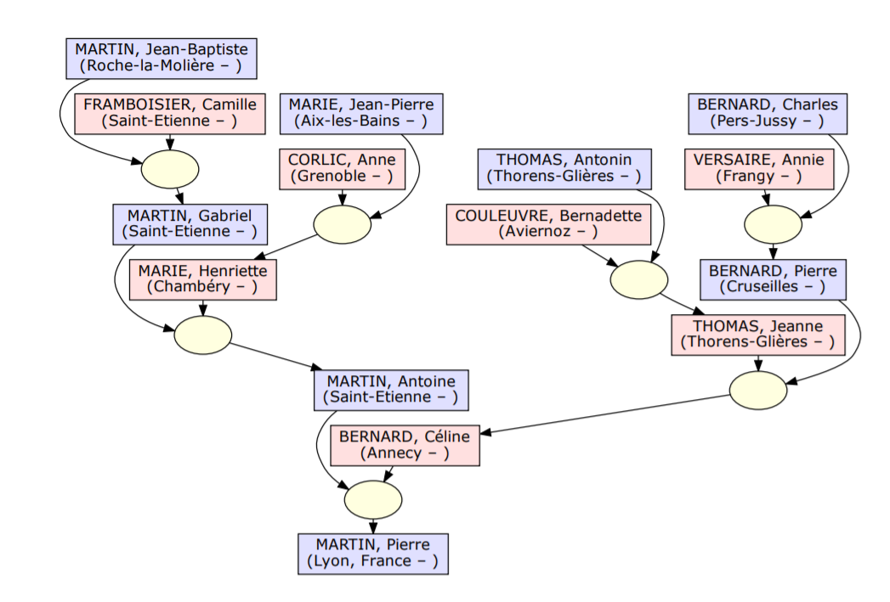
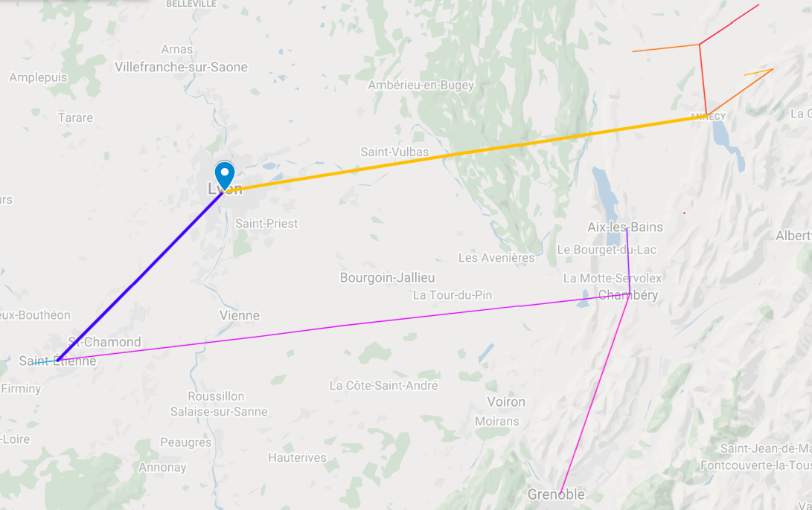

# gedcom-to-map

convert Gedcom to KML/GeoJSON file
 _geographic coordinates must be provided in GEDCOM file_
 
 
 ### Usage
 
 ```
gedcom_to_map.py [-h] [--max_missing MAX_MISSING]
                       [--max_line_weight MAX_LINE_WEIGHT]
                       [--format (kml, geojson)]
                       input_file output_file main_entity_id
```

### Example


* Input : [sample/intput.ged](samples/input.ged)


`gedcom_to_map.py samples/input.ged samples/output.kml @I0000@`

* Output : [sample/output.kml](samples/output.kml)

